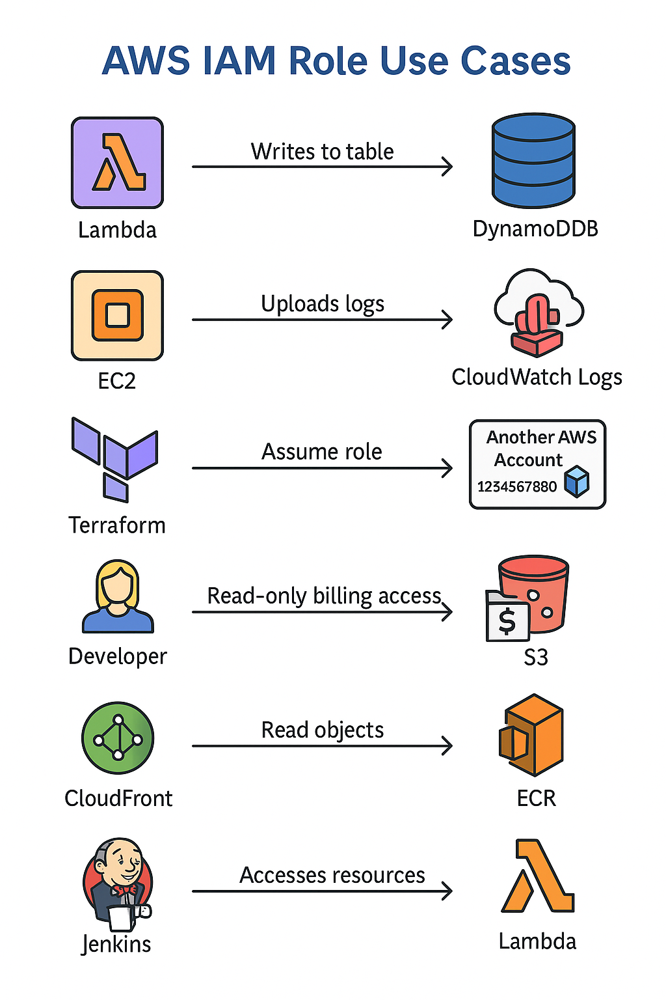

1) How you will assign s3 & Cloudwatch access to developer.

+---------------------+              +-------------------------+
| IAM User: DevA      |  <-- Login   | IAM Role: DevAccessRole |
| (No permission)     |  --------->  |                         |
+---------------------+              |  - S3: ReadWrite        |
                                     |  - CloudWatch: ReadOnly |
                                     +-------------------------+
                                               ↓
                                       [Assume Role Allowed]
                                               ↓
                                     Developer gets temporary
                                     access via sts:AssumeRole

How to set up:

Create IAM Role
Attach a policy to allow specific access (S3, CloudWatch)
Allow DevA to assume this role using sts:AssumeRole

2) Cross-Account IAM Role (Account A → Account B)
Developer in Account A needs access to S3 in Account B.

      ┌───────────────┐                      ┌────────────────────┐
      │ Account A     │                      │   Account B        │
      │ IAM User: Dev │                      │  IAM Role: Cross   │
      │               │                      │  S3ReadAccessRole  │
      └──────┬────────┘                      └──────┬─────────────┘
             │                                          │
     sts:AssumeRole (Trust Relationship)                │
             └─────────────────────────────────────────▶│
                      Dev assumes Cross-Account Role     │
                                                         │
                      Role has:                          ▼
                     - S3: List, GetObject on bucket XYZ

Setup:

Account B: Create IAM Role with S3 access
In the trust policy, allow AccountA's user or role to assume it.
Account A: IAM user assumes role using sts:AssumeRole

 3) Service-to-Service IAM Role (e.g., EC2 → S3)
 EC2 instance needs permission to write logs to S3.

 +---------------------+             +-----------------------------+
| EC2 Instance        | --------->  | IAM Role: EC2ToS3Role       |
| (No permission)     |             |  - S3: PutObject            |
+---------------------+             +-----------------------------+
         │                                  ↑
         │                                  │
    IAM Instance Profile (EC2 metadata → Role → Policy)
Setup:

Create IAM Role with S3 permission
Attach it as an Instance Profile to EC2
EC2 will automatically use the temporary credentials

4) EC2 Instance Writing to CloudWatch Logs

+--------------------------+           +-------------------------------+
| EC2 Instance: AppServer  | --------> | IAM Role: EC2CWLogRole        |
| (via Instance Profile)   |           |                               |
+--------------------------+           | - logs:PutLogEvents           |
                                       | - logs:CreateLogStream        |
                                       +-------------------------------+
                                                  ↓
                                       [Attached via instance profile]

when we want an EC2 instance to send application logs to CloudWatch Logs, we need to attach an IAM Role to that EC2 instance using something called an Instance Profile.

IAM User Switching Role Across Accounts

+----------------------------+         +--------------------------------+
| IAM User: DevA (Dev Acct)  | ----->  | IAM Role: ProdAdminRole        |
| No Prod Permission         |         | (In Prod Account)              |
+----------------------------+         | - ec2:StartInstances           |
                                       | - s3:DeleteObject              |
                                       +--------------------------------+
                                                  ↓
                                         [sts:AssumeRole using Console]

We use IAM Role Switching for cross-account access, especially when a developer or automation system in one AWS account (say, Dev Account) needs to perform actions in another account (say, Prod Account), without creating duplicate users.

| Use Case                                | Mechanism        | Tools Used                              |
| --------------------------------------- | ---------------- | --------------------------------------- |
| Developer Access                        | `sts:AssumeRole` | IAM User + IAM Role                     |
| Cross-Account Access                    | Trust Policy     | IAM Role in Target Account              |
| EC2 to S3 Access                        | Instance Profile | IAM Role + EC2                          |
| EC2 Instance Writing to CloudWatch Logs | Instance Profile | IAM Role + EC2 + CloudWatch Agent       |
| IAM User Switching Role Across Accounts | `sts:AssumeRole` | IAM User in Source + IAM Role in Target |

