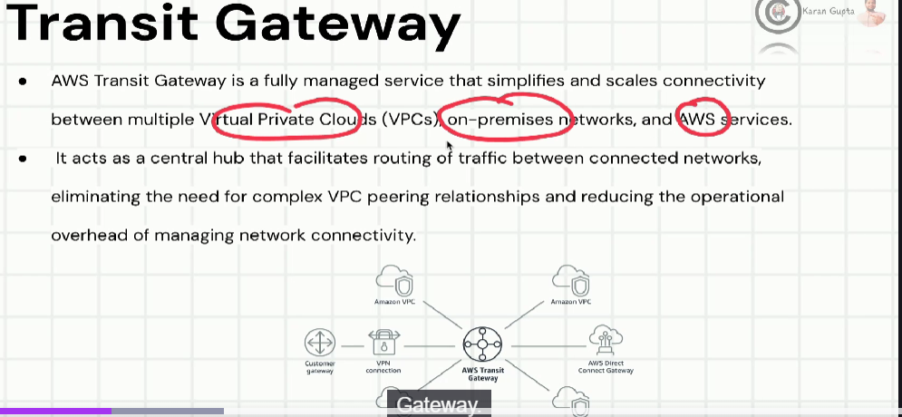

VPC peering

VPC peering is networking connection between two virtual private cloud (VPCS) in the same or different AWS regions allowing them to communicate with each other as if they were on the same network.

VPC peering enables you to establish private connectivity between VPCs without the need for internal gateways, VPC connections, or direct physical connections.

Key feature:-
Private connectivity
secure communication
Resource sharing
Cost optimization
transitive peering not supported.

Transit Gateway:-

