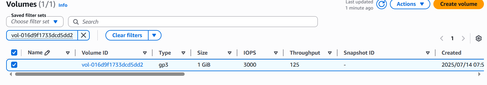
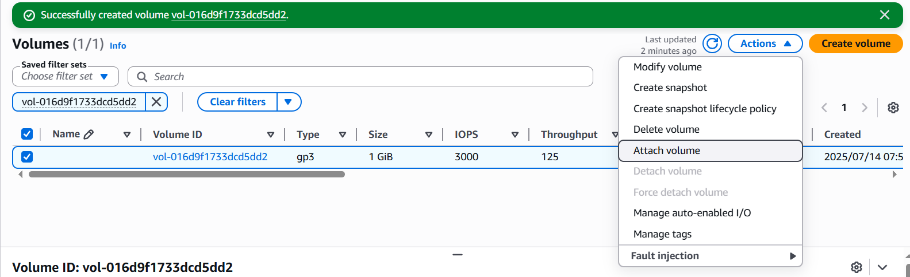
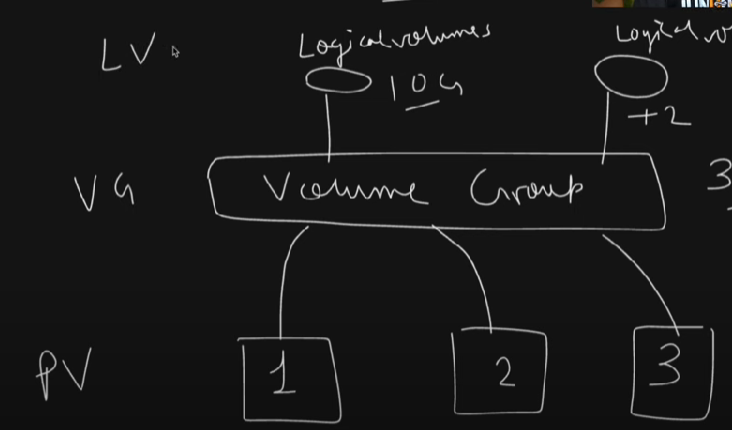

ubuntu@ip-172-31-90-26:~$ df -h
Filesystem      Size  Used Avail Use% Mounted on
/dev/root       6.8G  1.8G  5.0G  26% /
tmpfs           479M     0  479M   0% /dev/shm
tmpfs           192M  872K  191M   1% /run
tmpfs           5.0M     0  5.0M   0% /run/lock
/dev/xvda16     881M   86M  734M  11% /boot
/dev/xvda15     105M  6.2M   99M   6% /boot/efi
tmpfs            96M   12K   96M   1% /run/user/1000

ubuntu@ip-172-31-90-26:~$ lsblk
NAME     MAJ:MIN RM  SIZE RO TYPE MOUNTPOINTS
loop0      7:0    0 27.2M  1 loop /snap/amazon-ssm-agent/11320
loop1      7:1    0 73.9M  1 loop /snap/core22/1981
loop2      7:2    0 50.9M  1 loop /snap/snapd/24505
xvda     202:0    0    8G  0 disk
├─xvda1  202:1    0    7G  0 part /
├─xvda14 202:14   0    4M  0 part
├─xvda15 202:15   0  106M  0 part /boot/efi
└─xvda16 259:0    0  913M  0 part /boot

We will create new volume to attach to instance.

Then click to attach volume.
 

Then select instance name and device type.

Below is the output after attaching the volume to instance.
ubuntu@ip-172-31-90-26:~$ lsblk
NAME     MAJ:MIN RM  SIZE RO TYPE MOUNTPOINTS
loop0      7:0    0 27.2M  1 loop /snap/amazon-ssm-agent/11320
loop1      7:1    0 73.9M  1 loop /snap/core22/1981
loop2      7:2    0 50.9M  1 loop /snap/snapd/24505
loop3      7:3    0 49.3M  1 loop /snap/snapd/24792
loop4      7:4    0 73.9M  1 loop /snap/core22/2045
xvda     202:0    0    8G  0 disk
├─xvda1  202:1    0    7G  0 part /
├─xvda14 202:14   0    4M  0 part
├─xvda15 202:15   0  106M  0 part /boot/efi
└─xvda16 259:0    0  913M  0 part /boot
xvdf     202:80   0    1G  0 disk
xvdg     202:96   0    2G  0 disk
xvdh     202:112  0    3G  0 disk

physical volume ---> volume group-we create volume group from physical volume--> Logical volume- we will create logical volume from logical volume.

we will create physical volume using below command..
root@ip-172-31-90-26:~# lvm
lvm> pvcreate /dev/xvdf /dev/xvdg /dev/xvdh
  Physical volume "/dev/xvdf" successfully created.
  Physical volume "/dev/xvdg" successfully created.
  Physical volume "/dev/xvdh" successfully created.

lvm> pvs
  PV         VG Fmt  Attr PSize PFree
  /dev/xvdf     lvm2 ---  1.00g 1.00g
  /dev/xvdg     lvm2 ---  2.00g 2.00g
  /dev/xvdh     lvm2 ---  3.00g 3.00g

 Volume group created using below command.

  lvm> vgcreate devops_1 /dev/xvdf /dev/xvdg
  Volume group "devops_1" successfully created

Logical volume has been created
lvm> lvcreate -L 1G -n devops_lv devops_1
  Logical volume "devops_lv" created.''

  root@ip-172-31-90-26:~# mkdir /mnt/devops_lv_mount

  root@ip-172-31-90-26:~# mkfs.ext4 /dev/devops_1/devops_lv
mke2fs 1.47.0 (5-Feb-2023)
Creating filesystem with 262144 4k blocks and 65536 inodes
Filesystem UUID: adeb7184-3da7-42a1-bbd5-4fb6805c8814
Superblock backups stored on blocks:
        32768, 98304, 163840, 229376

Allocating group tables: done
Writing inode tables: done
Creating journal (8192 blocks): done
Writing superblocks and filesystem accounting information: done

root@ip-172-31-90-26:~# mount /dev/devops_1/devops_lv  /mnt/devops_lv_mount

root@ip-172-31-90-26:~# df -h
Filesystem                      Size  Used Avail Use% Mounted on
/dev/root                       6.8G  2.3G  4.4G  35% /
tmpfs                           479M     0  479M   0% /dev/shm
tmpfs                           192M  928K  191M   1% /run
tmpfs                           5.0M     0  5.0M   0% /run/lock
/dev/xvda16                     881M  148M  672M  18% /boot
/dev/xvda15                     105M  6.2M   99M   6% /boot/efi
tmpfs                            96M   12K   96M   1% /run/user/1000
/dev/mapper/devops_1-devops_lv  974M   24K  907M   1% /mnt/devops_lv_mount

**EBS volume mount to EC2 instance.**

root@ip-172-31-90-26:~# mkdir /mnt/devops_disk_mount
root@ip-172-31-90-26:/mnt# ls
devops_disk_mount  devops_lv_mount
root@ip-172-31-90-26:/mnt# mkfs -t ext4 /dev/xvdh
mke2fs 1.47.0 (5-Feb-2023)
/dev/xvdh contains a LVM2_member file system
Proceed anyway? (y,N) y
Creating filesystem with 786432 4k blocks and 196608 inodes
Filesystem UUID: f1cd182f-32e0-4994-abd8-5f249f993487
Superblock backups stored on blocks:
        32768, 98304, 163840, 229376, 294912

Allocating group tables: done
Writing inode tables: done
Creating journal (16384 blocks): done
Writing superblocks and filesystem accounting information: done

root@ip-172-31-90-26:~# mount /dev/xvdh /mnt/devops_disk_mount/

root@ip-172-31-90-26:~# df -h
Filesystem                      Size  Used Avail Use% Mounted on
/dev/root                       6.8G  2.3G  4.4G  35% /
tmpfs                           479M     0  479M   0% /dev/shm
tmpfs                           192M  932K  191M   1% /run
tmpfs                           5.0M     0  5.0M   0% /run/lock
/dev/xvda16                     881M  148M  672M  18% /boot
/dev/xvda15                     105M  6.2M   99M   6% /boot/efi
tmpfs                            96M   12K   96M   1% /run/user/1000
/dev/mapper/devops_1-devops_lv  974M   24K  907M   1% /mnt/devops_lv_mount
/dev/xvdh                       2.9G   24K  2.8G   1% /mnt/devops_disk_mount

