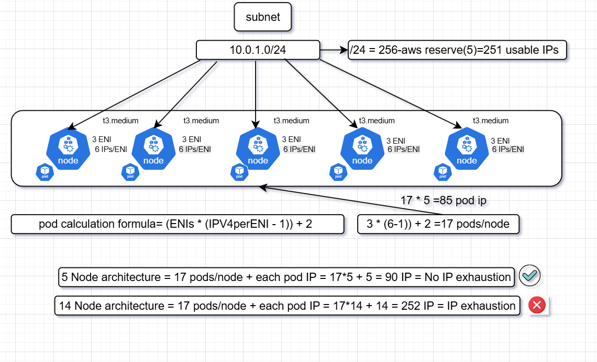

🚀 Kubernetes Networking Deep Dive — IP Allocation in EKS 🚀

I created this diagram to explain a critical Kubernetes networking concept that many cloud architects and SREs overlook how subnet size impacts pod scheduling in AWS EKS.
Here’s the scenario:
Subnet: 10.0.1.0/24 → 256 total IPs (251 usable after AWS reservations)
Node type: t3.medium → supports 3 ENIs × 6 IPs = 17 pods per node (based on AWS VPC CNI limits)
Calculation: (ENIs × (IPv4 per ENI − 1)) + 2 = 17 pods per node
💡 The diagram shows:
How IPs are allocated to pods and nodes.
Why adding more nodes without adjusting subnet size leads to IP exhaustion.
The sweet spot where subnet size and pod density align.
📊 Example takeaway:
5 nodes → 90 IPs → ✅ No exhaustion
14 nodes → 252 IPs → ❌ IP exhaustion
This is a real-world issue that hits cloud-native teams in production, and yet it’s easy

